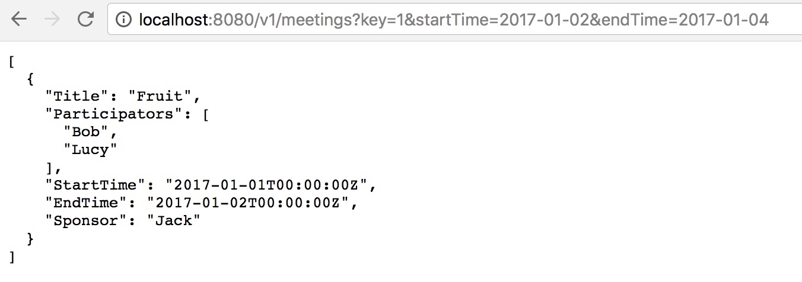
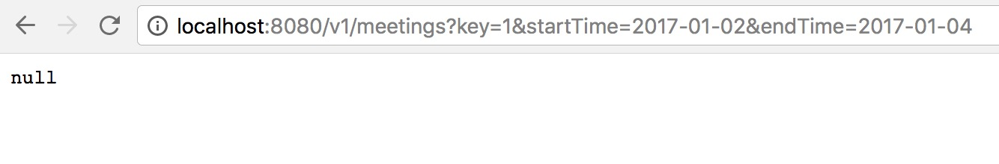

# Microservice-Agenda

[](https://travis-ci.org/smallGum/microservice-agenda)

In this project, we implement both command-line agenda program and web service agenda program. we build our project as a docker image and push it to docker hub.

## Build

For docker hub information, see [microservice-agenda on docker hub](https://hub.docker.com/r/gumcheng/microservice-agenda/)

```shell
# pull microservice-agenda image
$ docker pull gumcheng/microservice-agenda

Using default tag: latest
latest: Pulling from gumcheng/microservice-agenda
aa18ad1a0d33: Pull complete 
15a33158a136: Pull complete 
f67323742a64: Pull complete 
1b4531640cb0: Pull complete 
3e7f1f935f2c: Pull complete 
a4db2a724d81: Pull complete 
9a798ef77d30: Pull complete 
2eb0db2e75b6: Pull complete 
9f5dcecaa851: Pull complete 
62287a31bfe0: Pull complete 
Digest: sha256:06cacf43a4f6ee6a4b0faf7a0cd017e16fa6f6056140f428f4d685726d2dfe69
Status: Downloaded newer image for gumcheng/microservice-agenda:latest
```

## Run

start server and run agenda server:

```shell
$ docker run -p 8080:8080 --name agenda -v /data -d gumcheng/microservice-agenda service
```

run agenda client:

```shell
$ docker run -it --rm --net host -v $PATH_TO_SHARED_FILE:/data gumcheng/microservice-agenda cli
```

## Usage & Test

### agenda server usage & test

#### user

Register:

```shell
$ curl -d "username=Jack&password=123456" http://localhost:8080/v1/newusers

this is register handlerget Jack123456{
  "UserName": "Jack",
  "Password": "123456",
  "Email": "",
  "Tel": "",
  "Meetings": null
}
```

Login:

```shell
$ curl -d "username=Jack&password=123456" http://localhost:8080/v1/login

this is log in handlerget Jack123456{
  "UserName": "Jack",
  "Password": "123456",
  "Email": "",
  "Tel": "",
  "Meetings": null
}
```

Get user key:

```shell
$ curl -d "username=Jack&password=123456" http://localhost:8080/v1/users/getkey

this is get user key handler{
  "Key": 1,
  "UserName": "Jack"
}
```

Get user by id:

```shell
$ curl -d "id=1" http://localhost:8080/v1/users

this is get user by id handler{
  "UserName": "Jack",
  "Password": "123456",
  "Email": "",
  "Tel": "",
  "Meetings": null
}
```

List all users:

```shell
$ curl http://localhost:8080/v1/allusers?key=1

this is list all user handler[
  {
    "UserName": "Jack",
    "Password": "123456",
    "Email": "",
    "Tel": "",
    "Meetings": null
  },
  {
    "UserName": "Lucy",
    "Password": "123456",
    "Email": "",
    "Tel": "",
    "Meetings": null
  },
  {
    "UserName": "Bob",
    "Password": "123456",
    "Email": "",
    "Tel": "",
    "Meetings": null
  }
]
```

#### meeting

Create a new meeting:

```shell
$ curl -d "title=Fruit&participators=Bob&participators=Lucy&startTime=2017-01-01&endTime=2017-01-02" http://localhost:8080/v1/meetings?key=1

{
  "Title": "Fruit",
  "Participators": [
    "Bob",
    "Lucy"
  ],
  "StartTime": "2017-01-01T00:00:00Z",
  "EndTime": "2017-01-02T00:00:00Z",
  "Sponsor": "Jack"
}
```

Query a meeting:



Clear meetings:

```shell
$ curl -X DELETE http://localhost:8080/v1/meetings?key=1

{
  "ErrorIndo": "success!"
}
```

After Clearing:



### agenda client usage & test

#### help

```shell
$ docker run -it --rm --net host -v /Users/jack-cheng/Golang/src/microservice-agenda/cli/data:/data gumcheng/microservice-agenda cli -h

CLI-agenda is cooperative program for meeting management using cobra package.
        It supports commands such as register, login, creatingMeeting, clearMeetings and so on.

Usage:
  CLI-agenda [command]

Available Commands:
  cancelMeeting cancel meetings you sponsored with specified title
  cancelUser    remove an account from users
  clearMeetings clear all meetings with you as sponsor
  createMeeting Create a new meeting
  help          Help about any command
  login         for guest to login
  logout        logout
  queryMeetings Query meetings of current login user between specific time interval
  quitMeeting   quit from all meetings with you as participator
  register      to register a new user
  setEmail      set registered user's email
  setTel        set registered user's telephone number
  users         list all users

Flags:
      --config string   config file (default is $HOME/.CLI-agenda.yaml)
  -h, --help            help for CLI-agenda
  -t, --toggle          Help message for toggle

Use "CLI-agenda [command] --help" for more information about a command.
```

#### user

create `user1`

```shell
$ docker run -it --rm --net host -v /Users/jack-cheng/Golang/src/microservice-agenda/cli/data:/data gumcheng/microservice-agenda cli register -u user1 -p user1

register successfully
user:user1 register successfully!
```

we continue to create another two users `Alice` and `Bob` like above, then use `user1` to login:

```shell
$ docker run -it --rm --net host -v /Users/jack-cheng/Golang/src/microservice-agenda/cli/data:/data gumcheng/microservice-agenda cli login -u user1 -p user1

user:user1 login successfully
```

list all users:

```shell
$ docker run -it --rm --net host -v /Users/jack-cheng/Golang/src/microservice-agenda/cli/data:/data gumcheng/microservice-agenda cli users

there are 3  users:
--------------------------
user:user1
email:
tel:
--------------------------
user:Alice
email:
tel:
--------------------------
user:Bob
email:
tel:
--------------------------
```

`user1` logout:

```shell
$ docker run -it --rm --net host -v /Users/jack-cheng/Golang/src/microservice-agenda/cli/data:/data gumcheng/microservice-agenda cli logout

logout successfully
```

then we use `Alcie` to login and set her telephone number and email:

```shell
$ docker run -it --rm --net host -v /Users/jack-cheng/Golang/src/microservice-agenda/cli/data:/data gumcheng/microservice-agenda cli login -u Alice -p 123456

user:Alice login successfully
```
```shell
$ docker run -it --rm --net host -v /Users/jack-cheng/Golang/src/microservice-agenda/cli/data:/data gumcheng/microservice-agenda cli setTel -t 16354827954

set Alice\'s telephone to be 16354827954
```
```shell
$ docker run -it --rm --net host -v /Users/jack-cheng/Golang/src/microservice-agenda/cli/data:/data gumcheng/microservice-agenda cli setEmail -e 16354827954@163.com

set Alice\'s email to be 16354827954@163.com
```

now `Alice`'s information is update:

```shell
$ docker run -it --rm --net host -v /Users/jack-cheng/Golang/src/microservice-agenda/cli/data:/data gumcheng/microservice-agenda cli users

there are 3  users:
--------------------------
user:user1
email:
tel:
--------------------------
user:Alice
email:16354827954@163.com
tel:16354827954
--------------------------
user:Bob
email:
tel:
--------------------------
```

#### meeting

create three new meetings:

```shell
$ docker run -it --rm --net host -v /Users/jack-cheng/Golang/src/microservice-agenda/cli/data:/data gumcheng/microservice-agenda cli createMeeting -t "How to Cook" -p user1 -s 2017-07-08 -e 2017-07-12

create meeting How to Cook successfully

$ docker run -it --rm --net host -v /Users/jack-cheng/Golang/src/microservice-agenda/cli/data:/data gumcheng/microservice-agenda cli createMeeting -t "My Favourite Fruit" -p user1+Bob -s 2017-07-16 -e 2017-07-17

create meeting My Favourite Fruit successfully


$ docker run -it --rm --net host -v /Users/jack-cheng/Golang/src/microservice-agenda/cli/data:/data gumcheng/microservice-agenda cli logout

logout successfully


$ docker run -it --rm --net host -v /Users/jack-cheng/Golang/src/microservice-agenda/cli/data:/data gumcheng/microservice-agenda cli login -u user1 -p user1

user:user1 login successfully


$ docker run -it --rm --net host -v /Users/jack-cheng/Golang/src/microservice-agenda/cli/data:/data gumcheng/microservice-agenda cli createMeeting -t "Season You Like" -p Alice+Bob -s 2017-07-12 -e 2017-07-15

create meeting Season You Like successfully
```

query `user1`'s meetings between `2017-07-08` and `2017-07-13`:

```shell
$ docker run -it --rm --net host -v /Users/jack-cheng/Golang/src/microservice-agenda/cli/data:/data gumcheng/microservice-agenda cli queryMeetings -s 2017-07-08 -e 2017-07-13

user1\'s meetings between 2017-07-08 and 2017-07-13:

-------------------------------
title: How to Cook
participators: [user1]
start time: 2017-07-08
end time: 2017-07-12
sponsor: Alice
-------------------------------


-------------------------------
title: Season You Like
participators: [Alice Bob]
start time: 2017-07-12
end time: 2017-07-15
sponsor: user1
-------------------------------
```

`user1` quit meeting `How to Cook`:

```shell
$ docker run -it --rm --net host -v /Users/jack-cheng/Golang/src/microservice-agenda/cli/data:/data gumcheng/microservice-agenda cli quitMeeting -t "How to Cook"

quit meeting How to Cook successfully
```

`Alice` login and query her meeting between `2017-07-08` and `2017-07-17`:

```shell
$ docker run -it --rm --net host -v /Users/jack-cheng/Golang/src/microservice-agenda/cli/data:/data gumcheng/microservice-agenda cli logout

logout successfully


$ docker run -it --rm --net host -v /Users/jack-cheng/Golang/src/microservice-agenda/cli/data:/data gumcheng/microservice-agenda cli login -u Alice -p 123456

user:Alice login successfully


$ docker run -it --rm --net host -v /Users/jack-cheng/Golang/src/microservice-agenda/cli/data:/data gumcheng/microservice-agenda cli queryMeetings -s 2017-07-08 -e 2017-07-17

Alice\'s meetings between 2017-07-08 and 2017-07-17:

-------------------------------
title: Season You Like
participators: [Alice Bob]
start time: 2017-07-12
end time: 2017-07-15
sponsor: user1
-------------------------------


-------------------------------
title: My Favourite Fruit
participators: [user1 Bob]
start time: 2017-07-16
end time: 2017-07-17
sponsor: Alice
-------------------------------
```

As you can see, there are only two meeting `Season You Like` and `My Favourite Fruit` left. The meeting `How to Cook` is canceled since `user1` quited and there were no participators left.

cancel `Alice`'s meeting `My Favourite Fruit`:

```shell
$ docker run -it --rm --net host -v /Users/jack-cheng/Golang/src/microservice-agenda/cli/data:/data gumcheng/microservice-agenda cli cancelMeeting -t "My Favourite Fruit"
```

cancel success:

```shell
$ docker run -it --rm --net host -v /Users/jack-cheng/Golang/src/microservice-agenda/cli/data:/data gumcheng/microservice-agenda cli queryMeetings -s 2017-07-08 -e 2017-07-17

Alice\'s meetings between 2017-07-08 and 2017-07-17:

-------------------------------
title: Season You Like
participators: [Alice Bob]
start time: 2017-07-12
end time: 2017-07-15
sponsor: user1
-------------------------------
```

#### cancel one's account

this operation will influence both meetings and users
cancel `user1`'s account:

```shell
$ docker run -it --rm --net host -v /Users/jack-cheng/Golang/src/microservice-agenda/cli/data:/data gumcheng/microservice-agenda cli logout

logout successfully


$ docker run -it --rm --net host -v /Users/jack-cheng/Golang/src/microservice-agenda/cli/data:/data gumcheng/microservice-agenda cli login -u user1 -p user1

user:user1 login successfully


$ docker run -it --rm --net host -v /Users/jack-cheng/Golang/src/microservice-agenda/cli/data:/data gumcheng/microservice-agenda cli cancelUser

cancel user1 account successfully
```

`Bob` login and see all the users and meetings:

```shell
$ docker run -it --rm --net host -v /Users/jack-cheng/Golang/src/microservice-agenda/cli/data:/data gumcheng/microservice-agenda cli login -u Bob -p 123456

user:Bob login successfully


$ docker run -it --rm --net host -v /Users/jack-cheng/Golang/src/microservice-agenda/cli/data:/data gumcheng/microservice-agenda cli users

there are 2  users:
--------------------------
user:Alice
email:16354827954@163.com
tel:16354827954
--------------------------
user:Bob
email:
tel:
--------------------------


$ docker run -it --rm --net host -v /Users/jack-cheng/Golang/src/microservice-agenda/cli/data:/data gumcheng/microservice-agenda cli queryMeetings -s 2017-07-08 -e 2017-07-17
Bob\'s meetings between 2017-07-08 and 2017-07-17:

none.
```

both `user1` account and meeting `Season You Like` are canceled.